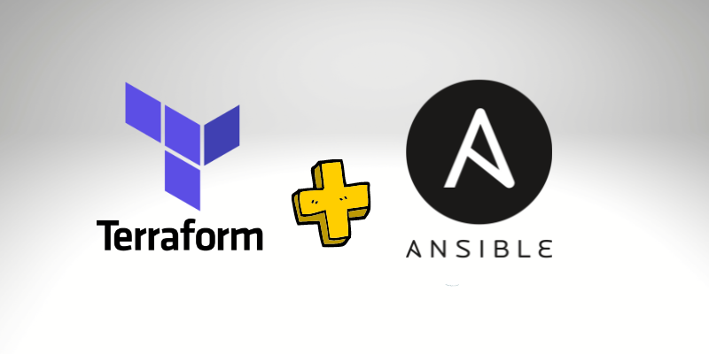

<h1 align="center">
  Terraform e Ansible na Amazon AWS.
</h1>

  

  <a href="#-tecnologias">Tecnologias</a>&nbsp;&nbsp;&nbsp;|&nbsp;&nbsp;&nbsp;
  <a target="_blank" href="https://github.com/leonardoalmir/projeto-terraform/">Projeto</a>&nbsp;&nbsp;&nbsp;|&nbsp;&nbsp;&nbsp;
  <a href="#memo-licença">Licença</a>

 

## 💻 Projeto

Rodando projeto Python3, usando virtualenv e Django. Infra criada com **Terraform e Ansible na Amazon AWS**.

## 🚀 Tecnologias

- Terraform
- Ansible
- Python
- Django
- AWS EC2
- AWS CLI

## :memo: 📔 Conhecimentos abordados

- [x] Fundamentos da infraestrutura como código
- [x] Como instalar e configurar o AWS CLI
- [x] Criar um par de chaves para permitir a conexão SSH
- [x] Fazer alterações necessárias no grupo de segurança na AWS para fazermos requisições para uma instância
- [x] Criar instâncias na AWS ultilizando o Terraform
- [x] Boas práticas na infraestrutura como código
- [x] Criar um servidor http para testes rápidos com o busybox httpd
- [x] Configurar instâncias na AWS ultilizando o Ansible
- [x] Como executar o playbook do Ansible
- [x] Praticar com diferentes módulos do Ansible
- [x] Como utilizar o Ansible para instalar programas
- [x] Utilizar o Ansible para criar um ambiente virtual do python (Virtualenv)
- [x] Fazer a instalação de dependências do python dentro do ambiente virtual
- [x] Executar “comandos do terminal” através do Ansible utilizando o parâmetro shell:
- [x] Modificar o conteúdo de um arquivo

## :memo: Licença

Esse projeto está sob a licença MIT. Veja o arquivo [LICENSE](https://github.com/leonardoalmir/projeto-terraform/blob/main/LICENSE) para mais detalhes.

## 🚧 Projeto:

Link do Projeto: [Link do Projeto](https://github.com/leonardoalmir/projeto-terraform/)

---
Feito por Leonardo Almir